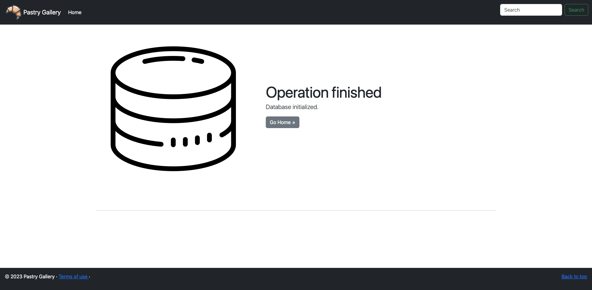

# Projet Pastry

Simple projet effectuant un CRUD sur une entitée Pastry.

- Il permet d'initialiser une base de données avec une pâtisserie
- Il permet de rechercher une pâtisserie grâce à la barre de recherche

# Technologies

- JakartaEE 9
- JPA (Hibernate ORM 6.1.5.Final)
- JSTL (2.0.0)
- Mysql (8.0.31)

# Technologies

# Aperçus

##### Insertion des données en base de données

##### Liste des produits

